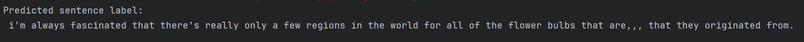
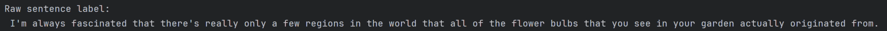

# Abstract

Sign Vision is a set of machine learning models that will extract posture information and hand coordinates from videos of American Sign Language (ASL) to translate them into complete English sentences. SignVision will use a combination of Google MediaPipe Hand Landmarking model and CMU Open Pose model. The overall purpose of this project is to translate ASL into English for people who don’t understand sign language.

# Project Overview

- By: Zhening Hu & Vamsi Garghi
- Project Purpose: The overall purpose of this project is to translate ASL into English for people who don’t understand sign language.
- Motivation: 
  - To break the communication barrier between as many people as possible. 
  - Explore the ASL language to its full extent.
  - Better interactivity between deaf and hard of hearing people to communicate more independently.
 - Methods
   - How2Sign dataset (34gb) is taken and a training model is run to get features for the training model.
   - Features are extracted from the dataset such as left & right hand cordinates,         Torso & Limb cordinates and tokenized labels.
   - These features are used to created the training dataset (.pt file) and           created the vocab meta file for english translations.
   - The training dataset is then used to create sequence modeling
   - Using the sequence modeling we will output english text based on video and its information. 

# Dataset Information

## Raw Data file Structure


- Our Model is trained on a pose-based representation derived from the How2Sign dataset, which provides parallel ASL videos and English sentence-level annotations. Each sample in our dataset consists of:
 - An ASL video clip of a signer.
  
 
 - A corresponding English sentence from the How2Sign csv files (used as the target text   for translation).
 - 


## Data Preprocessing Stage

- Convert the green screen videos into different features such as:
 - Left and right hand landmarks such as x, y coordinates and associated confidence scores. (Mediapipe)
 - Upper-body keypoints (e.g., shoulders, elbows, wrists) and their confidence scores. (MMPose)

# Architecture

## Model Architecture Encoder - Decoder 

### Encoder

- Encoder: 1D Convolutional Layer across frames to learn relationship between frames.
- Stack of 6 transformer encoder layers to learn a representation of the coordinate information in each frame and how this information changes across frames (from 1D CNN).

 ### Decoder 
 
- Decoder: Stack of Transformer Decoder Layers with cross attention to generate next token using coordinates representation learned from encoder.
- Input to decoder: take tokenized sentence label and shift sequence to the right, for example:
- Actual token sequence:
    (w1, ..., wN, [SEP])
- Shifted token sequence:
    ([CLS], w1, ..., w_{N-1}, [SEP])
- Each decoder layer also use cross attention to use coordinate information in predicting new token.
- Query from decoder, key and value from encoder.
- Output of the decoder is mapped to tokenizer dimensions using a final linear layer.
- Objective Function: Cross Entropy Loss between decoder output and label tok.

### Cross-Attention

- Allows the decoder to “ask” the encoder which parts of the pose information is relevant to predicting words.
- The encoder will respond with pose information, this is how our model relates visual data to text.


### Model Architecture Diagram


# Results Evaluation

## Model output with predicted sentence:



## Actual reference sentence:



## ROGUE - 1

- Measures the number of words in the raw sentence that is present in the predictive sentence.
- Number of Overlapping words are: 21/27 
Recall-Oriented Understudy for Gisting Evaluation (ROUGE 1): 0.778


## BLEU - 1

- Measures the number of words in the predictive sentence that is present in the raw sentence.
- ARound 21 words present so the Bilingual Evaluation Understudy (BLEU - 1): 0.772


# Repo Structure

```bash
METCS777-Term-Project-Team6/
│
├── .idea/
│   ├── inspectionProfiles
│   ├── .gitignore
│   └── METCS777-Term-Project.iml
│   └── misc.xml
│   └── modules.xml
│   └── vcs.xml
│
├── code/
│   └── __pycache__
│   └── init.py
│   └── compare.py
│   └── data.py
│   └── inference.py
│   └── lab.ipynb
│   └── landmarker_demo.py
│   └── model.py
│   └── pretrained_model.py
│   └── tokenizer.py
│   └── train.py
│   └── transforms.py
│   └── utils.py
├── data/
│   ├── english_csv
│       └── how2sign_realigned_train.csv 
│   ├── precomputed_train
│       └── sample_00000.pt
│       └── ....
│       └── sample_01002.pt
│       └── vocab_meta.pt
│   ├── pretrained_model
│       └── checkpoint
│          └── rtmpose-s_simcc-body7_pt-body7_420e-256x192-acd4a1ef_20230504.pth
│       └── mmpose_config
│          └── __init__.py
│          └── default_runtime.py
│          └── rtmpose_m_8xb256-420e_coco-256x192.py
│       └── hand_landmarker.task
├── output/
│   ├── {output}.png
├── .gitignore
├── README.md
├── requirements.txt

```


# Installation & Environment Setup

## Cloud Environment Setup

NOTE*** The raw videos are not in the github repo so follow the steps below to run the training model with the training dataset instead. 

### S3

- Configure an S3 bucket as demonstrated in Lab 1. 
- Ensure the bucket name is globally unique to avoid conflicts.
- Create a separate output folder within the S3 bucket to store the training files.

### EMR with Apache Spark

Configure Spark as done in previous labs.
Your Spark job should have the below arguments:
1. raw dataset
2. data/raw_videos for features
3. data/raw_videos for tokenization
4. data/raw_videos for vocab
5. output folder argument for training dataset


# How to run the code

## Clone the Repo

``` 
git clone https://github.com/victorhuzhening/METCS777-Term-Project-Garghi-Hu.git
cd METCS777-Term-Project-Garghi-Hu
```
## Install Dependency

Review the requirements.txt file and ensure that all installed dependencies match the specified versions. This step is critical to prevent compatibility issues or runtime errors.
If you are using Anaconda you may execute the scripts below in order to get a stable environment.
```
# Create a fresh env with Python 3.10
conda create -n MMPoseGood python=3.10 -y

# Activate it
conda activate MMPoseGood

# 1. Make pip compatible with old build systems (and satisfy <= 25.3.2)
python -m pip install --upgrade "pip<24"
python -m pip install --upgrade setuptools wheel

# 2. Core required libraries
pip install numpy==1.26.4
pip install mediapipe pyarrow

# 3. PyTorch CPU stack
pip install torch==2.1.0+cpu torchvision==0.16.0+cpu --index-url https://download.pytorch.org/whl/cpu

# 4. OpenCV compatible with NumPy 1.x
pip install opencv-python==4.10.0.84

# 5. OpenMMLab installer
pip install openmim==0.3.9

# chumpy has annoying build isolation issues - disable it explicitly
python -m pip install chumpy==0.70 --no-build-isolation

# Other low-level dependencies
pip install \
    xtcocotools==1.14.3 \
    pycocotools==2.0.10 \
    cython==3.2.1 \
    shapely==2.1.2 \
    terminaltables==3.1.10 \
    json-tricks==3.17.3 \
    munkres==1.1.4

# Core runtime lib
mim install "mmengine==0.10.7"

# Computer vision core
mim install "mmcv==2.1.0"

# MMPose detection
mim install "mmdet==3.2.0"

# MMPose
mim install "mmpose==1.3.2"
```

## Run repo locally

### Custom training data

If you want to get custom training data outside of the dataset included in /data/precomputed_train, you may run the following scripts on any directory containing raw videos.
The output will be a collection of PyTorch files (1 video = 1 .pt file), and a single vocab meta file.

Note: manually replace video_dir, labels_path, and save_dir with your own paths.

```
import os
import torch
from torch.utils.data import DataLoader

MediaPipeCFG = MediaPipeCfg("pretrained_model/hand_landmarker.task")
options = MediaPipeCFG.create_options()
MP_model = MediaPipeCFG.HandLandmarker.create_from_options(options)


MMPoseCFG = MMPoseCfg(checkpoint_path='pretrained_model/checkpoint/rtmpose-s_simcc-body7_pt-body7_420e-256x192-acd4a1ef_20230504.pth',
                      config_path='pretrained_model/mmpose_config/rtmpose_m_8xb256-420e_coco-256x192.py')
body_model = MMPoseCFG.create_model()

save_dir = "precomputed_train"
os.makedirs(save_dir, exist_ok=True)

pre_train_dataset = ASLData(
    video_dir="data/raw_videos",
    MP_model=MP_model,
    body_cfg=MMPoseCFG,
    body_model=body_model,
    labels_path="data/how2sign_realigned_train.csv",
    min_frequency=1,
    max_frames=300,
    frame_subsample=2,
)

pre_train_loader = DataLoader(
    pre_train_dataset,
    batch_size=1,
    shuffle=False,
    num_workers=0,
    collate_fn=lambda b: b[0],
)

torch.save(
    {
        "vocab": pre_train_dataset.vocab,
        "pad_id": pre_train_dataset.pad_id,
    },
    os.path.join(save_dir, "vocab_meta.pt"),
)

for idx, sample in enumerate(pre_train_loader):
    sample_to_save = {
        "features": sample["features"],
        "feature_len": int(sample["feature_len"]),
        "label_ids": sample["label_ids"],
        "label_len": int(sample["label_len"]),
        "filename": sample["filename"],
        "raw_label": sample["raw_label"],
    }

    out_path = os.path.join(save_dir, f"sample_{idx:05d}.pt")
    torch.save(sample_to_save, out_path)

    if (idx + 1) % 50 == 0:
        print(f"PROGRESS: Saved {idx+1} samples...")
```

### Model training

To train the model yourself, you may either manually configure the arguments inside train.py and run the main function, or execute the following script in terminal from the project's root directory:

Note: please check main function in train.py for configurable hyperparameters.
```
python code/train.py --feature_dir ./data/precomputed_train 
```

### Model inference

To translate a single raw video into an English sentence, you must go into inference.py and manually configure the paths for CKPT_PATH and INPUT_PATH, where CKPT_PATH is the trained model and INPUT_PATH is the video you desire to translate.

```
# Path to trained model
CKPT_PATH = "../data/best_encoder_decoder_model.pt"

# Path to raw video you want to translate
INPUT_PATH = "path/to/raw_videos/-70D86eMmIc_3-5-rgb_front.mp4"
```
